# El proceso de hoy termina en «te contactaremos»

> Cómo se compra un seguro hoy y qué cambia con un asesor que conversa. Sin tecnicismos.
> Las capturas del proceso actual son reales.

**▶ [Ver el video](https://www.loom.com/share/3a776d547fc347a8aef9760d202e106d)** · **[Probar la aplicación](https://amparito-zeta.vercel.app/chat)** · [Esta misma página con el diseño completo](https://amparito-zeta.vercel.app/como-funciona)

---

## 1 · Así funciona hoy

Cuatro pantallas del recorrido actual. Cada una añade un paso, y ninguna entrega una respuesta.

### Paso 1 · Hay que saber de antemano qué se busca

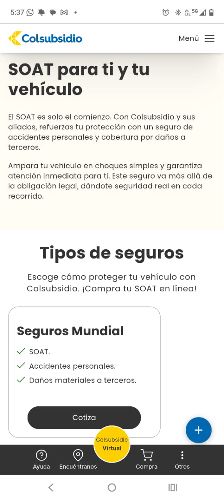

El punto de partida es un catálogo. Quien no sabe si necesita un seguro de vida o uno de accidentes tiene que averiguarlo por su cuenta antes de empezar.

### Paso 2 · El proceso se sale de Colsubsidio

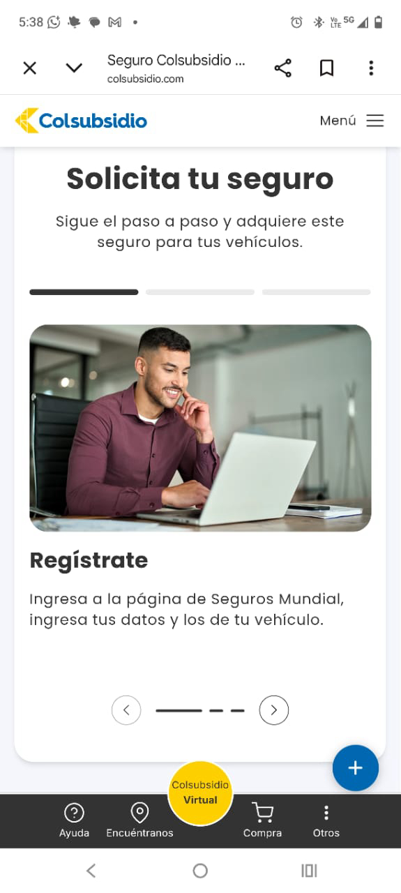

El primer paso del «paso a paso» es registrarse en la página de la aseguradora y volver a escribir los mismos datos. La gestión queda del lado de la persona.

### Paso 3 · Y termina en «te contactaremos»

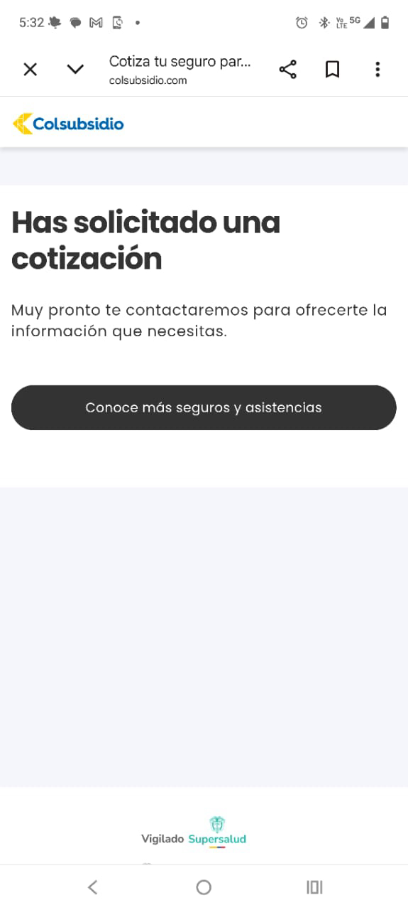

No hay precio, ni coberturas, ni exclusiones, ni un número de radicado. La persona hizo todo el esfuerzo y se queda igual que al principio.

### Paso 4 · La respuesta llega hasta 3 días después

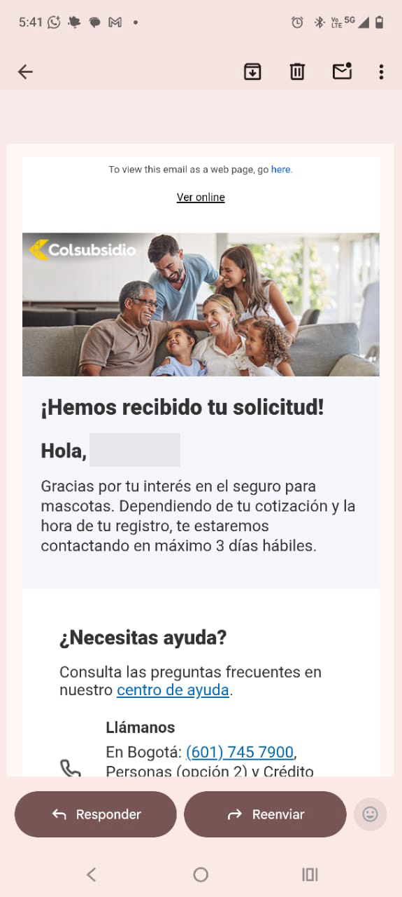

Un correo automático confirma la solicitud y anuncia contacto en máximo 3 días hábiles. Para entonces la decisión ya se enfrió, o se tomó en otra parte.

> Para comprar cualquier seguro hay que llenar un formulario que se vuelve tedioso, y lo único que
> devuelve es la confirmación de que se solicitó una cotización. Más allá de eso, nada. Toda la carga
> queda en el cliente: le toca ir a la aseguradora y hacerse él mismo la gestión.
>
> — *Sobre el proceso actual de compra*

---

## 2 · Antes y ahora

El cambio no es de diseño: es qué recibe la persona cuando termina de hablar.

| | Hoy | Con Amparito |
|---|---|---|
| **Qué recibe la persona al final** | Un mensaje de «te contactaremos» | Una cotización con su precio, qué cubre y qué no, y el paso de pago |
| **Cuánto tiene que esperar** | Hasta 3 días hábiles | Lo que dura la conversación |
| **Quién hace la gestión** | La persona, y además en la página de la aseguradora | El asistente, sin salir del mismo chat |
| **Qué le preguntan** | Un formulario igual para todos | Lo mínimo. A quien ya está afiliado, casi nada: sus datos ya están |
| **Si tiene una duda** | Centro de ayuda, o llamar | Se responde ahí mismo, leyendo el clausulado real del producto |
| **Si prefiere un humano** | Otro canal, y contar todo de nuevo | Lo pide y la conversación se transfiere con el contexto puesto |
| **Si el seguro no le conviene** | Le cotizan igual | Se lo dice, con el motivo, y le ofrece lo que sí le sirve hoy |

---

## 3 · Conozcamos a Laura

Laura entra al asesor porque quiere proteger a su familia, pero no sabe qué seguro necesita.
Esto es todo lo que pasa, en una sola conversación.

**👋 Laura llega sin saber qué necesita**

Quiere proteger a su familia, pero no sabe qué seguro le sirve. No tiene que saberlo: la conversación abre por su situación de vida, no por el catálogo.

**🔎 En segundos se sabe si ya es de la comunidad**

El sistema reconoce si Laura ya está afiliada a Colsubsidio o si llega desde fuera, y sigue por el camino que corresponda.

**💛 Si es afiliada, no la interrogan**

Se usa la información que ella ya autorizó para personalizar la conversación y mostrarle lo que aplica a su perfil. Antes de eso se le pide un dato que solo ella sabría, para confirmar que es ella.

**🚪 Si no lo es, también la atienden completa**

La conversación se adapta y la guía con un proceso pensado para alguien nuevo. Identificarse nunca es un requisito.

**🧠 Entiende, recomienda y explica el porqué**

Mientras conversan, entiende qué necesita y le recomienda el seguro adecuado — con la razón escrita de cada recomendación, no como una caja negra.

**✋ Y a veces le dice que no**

Si un producto no le sirve hoy, se lo dice y le ofrece lo que sí. Una recomendación en la que caben los «no» es una en la que se puede confiar.

**☎️ Puede pedir un humano cuando quiera**

Si Laura escribe «quiero hablar con un asesor», la conversación se transfiere sin que ella tenga que repetir nada.

**✅ Y si decide seguir, termina ahí mismo**

El mismo chat genera la cotización, muestra el valor y entrega el paso de pago para completar la compra en ese momento.

---

## 4 · Y así se ve

El mismo recorrido, en pantallas de la aplicación funcionando. Ocho pasos, una sola conversación.

**▶ [Ver el video](https://www.loom.com/share/3a776d547fc347a8aef9760d202e106d)** · **[Probarlo tú](https://amparito-zeta.vercel.app/chat)**

### Paso 1 · La promesa, sin letra pequeña

«Sin formularios, sin te contactaremos, sin esperas». Lo que se promete arriba es exactamente lo que pasa abajo.

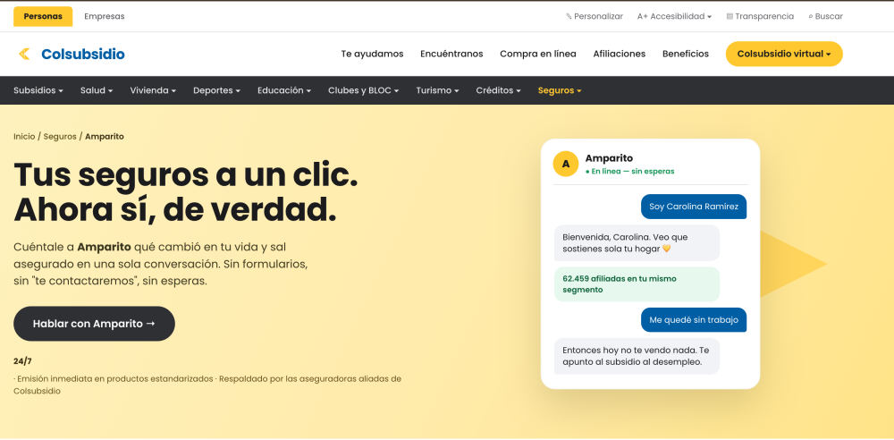

### Paso 2 · Abre por la vida, no por el catálogo

No hay menú de productos. Hay una invitación a contar qué cambió — y quien no quiera dar su nombre tiene su botón para seguir igual.

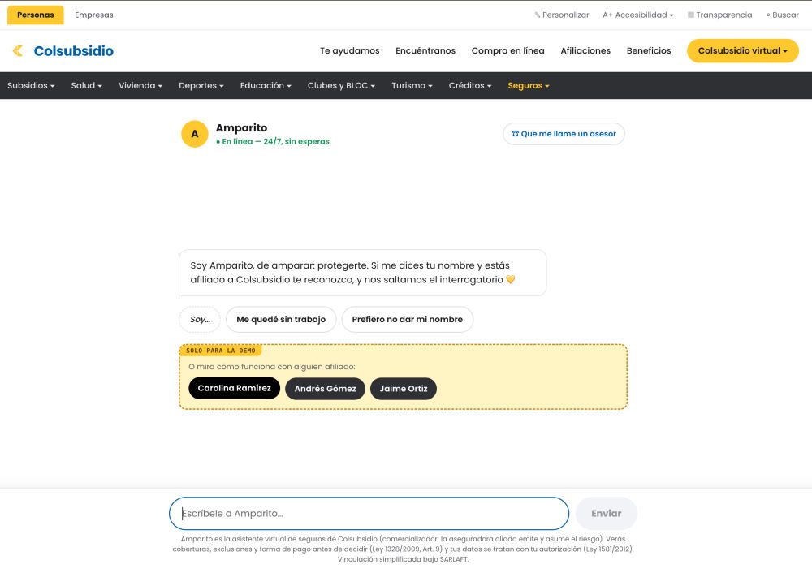

### Paso 3 · Reconoce al afiliado, y lo comprueba

Lo encuentra en la base y le pide un dato que solo él sabría antes de enseñarle nada suyo. Hasta que no lo confirma, sus datos no se usan.

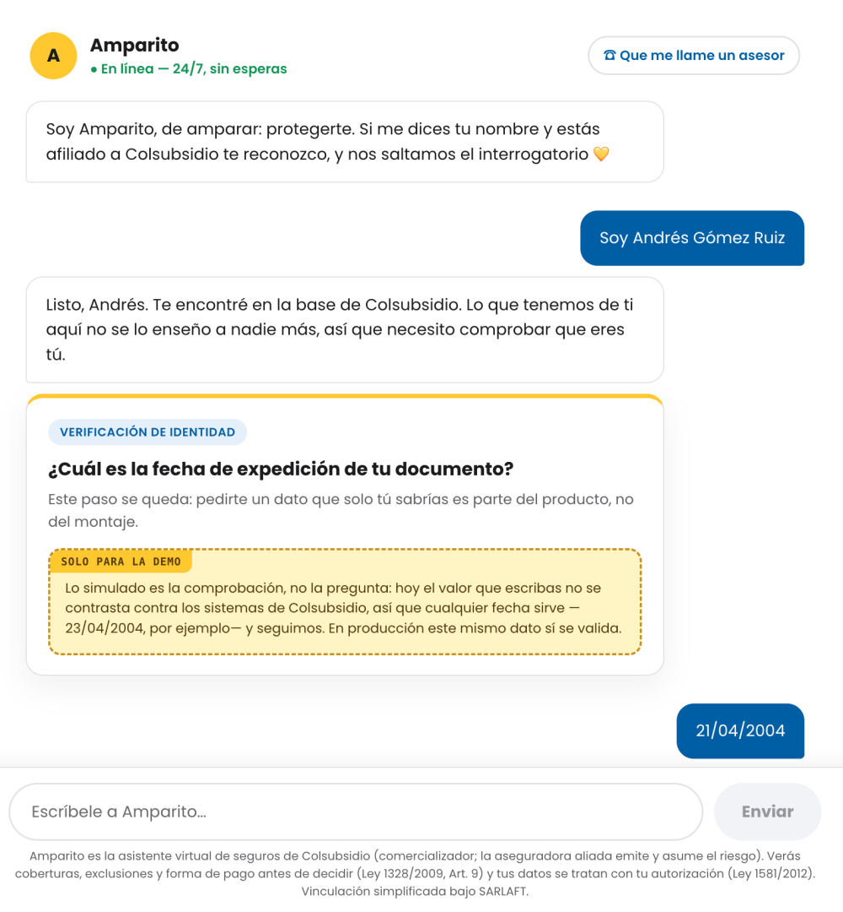

### Paso 4 · Recomienda con el porqué escrito

No es «te sugerimos esto». Es qué producto, en qué orden y por qué motivo — cada razón viene del motor, no del texto.

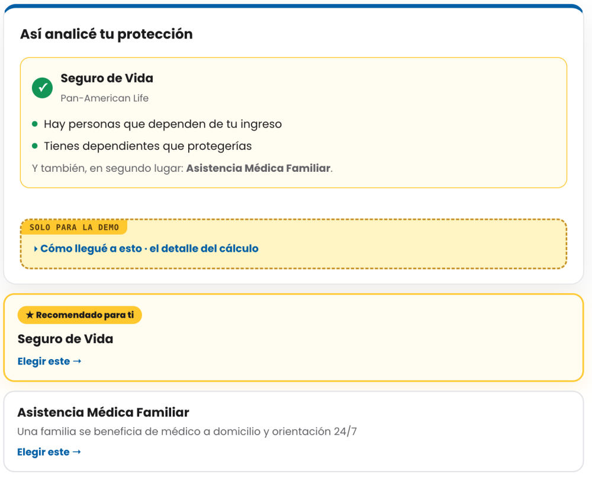

### Paso 5 · Y se puede auditar en la misma pantalla

Qué supo de la persona y de dónde lo supo, qué regla aplicó y cuánto pesó cada una. Sin salir de la conversación.

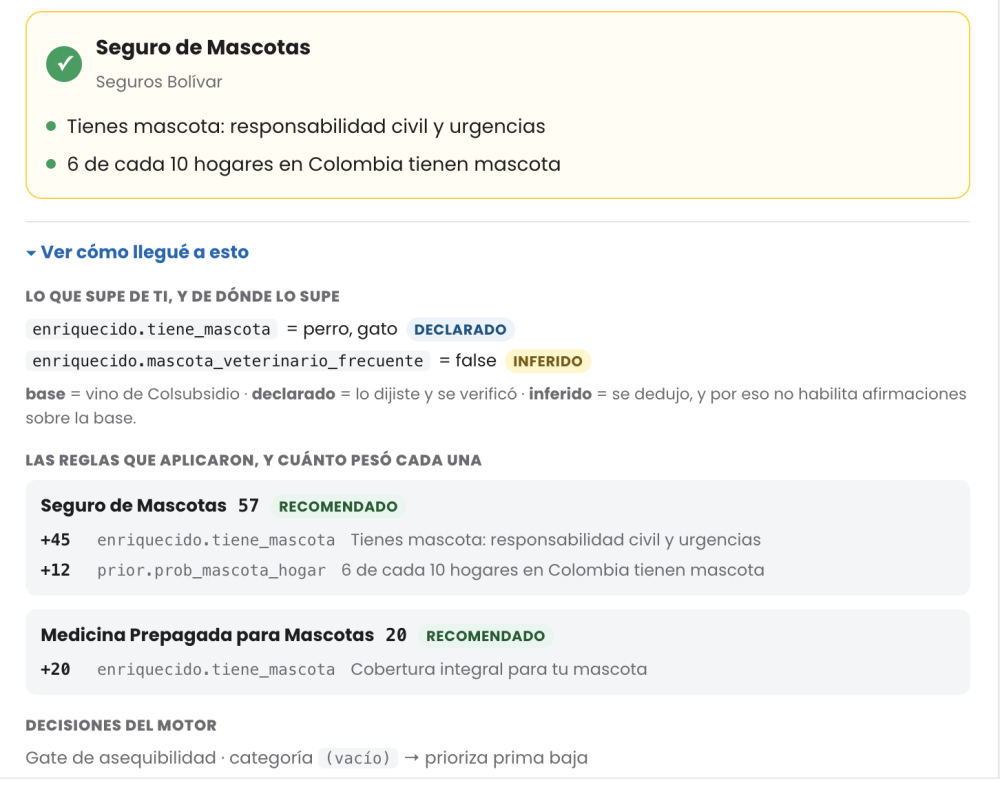

### Paso 6 · Cotiza con lo que cubre y lo que NO

El precio, el valor asegurado y las exclusiones antes de decidir — que es lo que exige el Art. 9 de la Ley 1328, y aquí llega sin pedirlo.

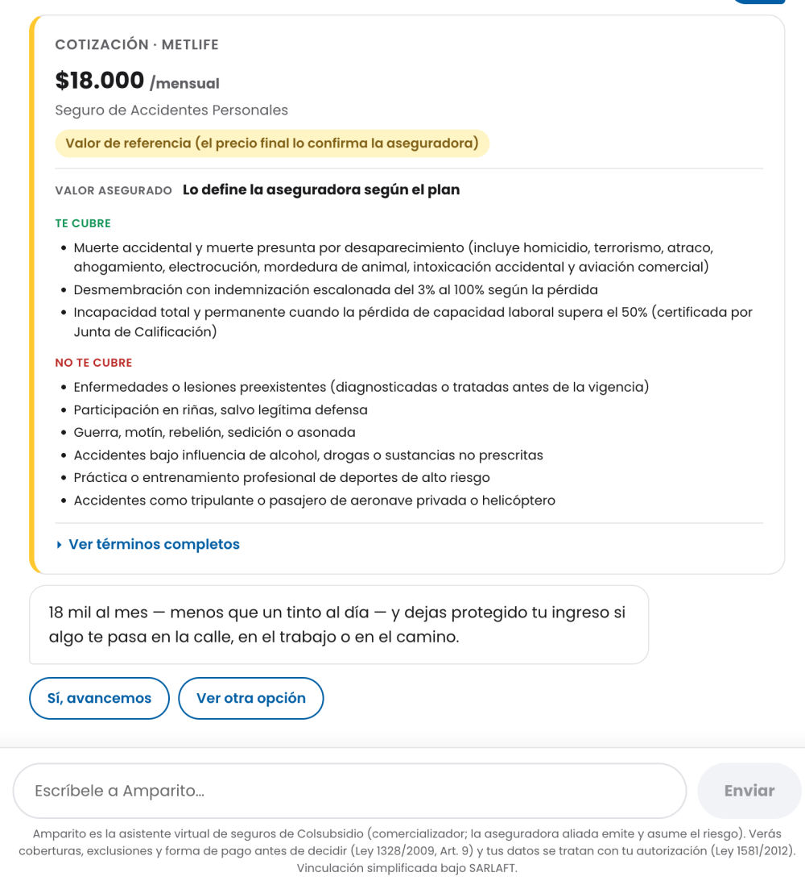

### Paso 7 · El formulario llega escrito, y se paga ahí

Lo que ya se sabe viene puesto; solo falta lo que nadie tiene. Y el pago va en el mismo hilo, rotulado como simulado.

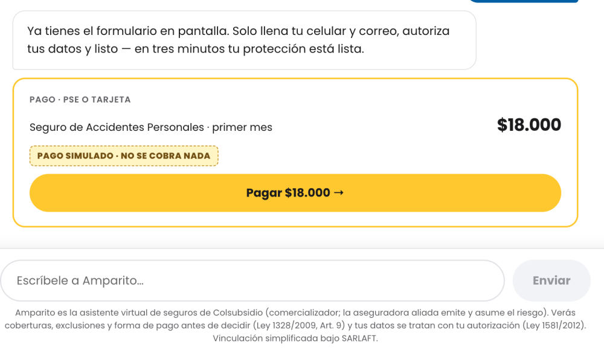

### Paso 8 · Termina con algo en la mano

Número, tomador, vigencia y qué pasa de aquí en adelante. Donde hoy había un «te contactaremos», aquí hay una solicitud completa.

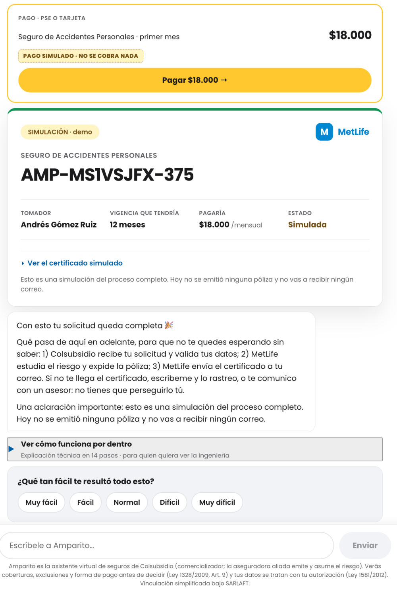

---

## 5 · Qué hay por dentro

Un diagrama de arquitectura, contado sin tecnicismos.

### Quién habla con quién

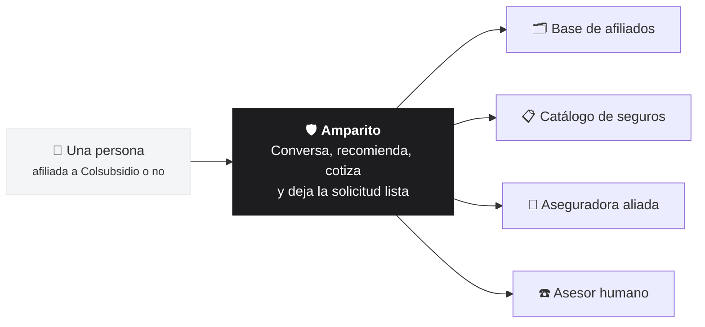

### Qué piezas hay dentro, y cuál decide

Las tres **en negrita** son las que sostienen la garantía.

| Pieza | Qué hace |
|---|---|
| La conversación | Lo que la persona ve y escribe. Aquí no se decide nada: solo se pinta lo que el servidor mandó. |
| **El que redacta** | Un modelo de lenguaje. Pone las palabras y conversa — pero no elige el producto, no inventa un precio ni una cobertura. |
| **El motor que decide** | Reglas escritas, siempre las mismas: con el mismo perfil sale la misma recomendación, y cada punto trae su razón. |
| **Las compuertas** | Revisan lo que el modelo propone antes de que llegue a la pantalla. Si afirma algo que nadie verificó, no sale. |
| La base de afiliados | Para reconocer a quien ya es de Colsubsidio y no volver a preguntarle lo que ya se sabe de él. |
| El catálogo | Los seguros reales, con lo que cubren, lo que no, y la fuente de cada dato. |
| La aseguradora | Quien emite la póliza y asume el riesgo. Colsubsidio comercializa. |
| La traza | El registro de por qué se recomendó cada cosa. Se puede abrir en pantalla, en la misma conversación. |

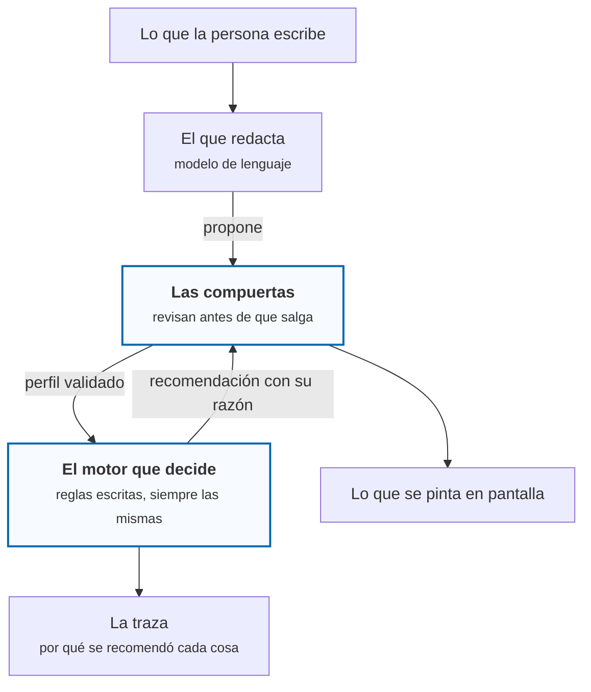

**La regla que sostiene todo lo demás: el motor calcula y el servidor valida; el que escribe no
decide.** Por eso una recomendación se puede explicar punto por punto, y por eso no hay forma de que
aparezca en pantalla un precio o una cobertura que nadie verificó.

---

## Donde hoy el proceso termina con «te contactaremos», aquí termina con una cotización generada y un paso de pago listo para asegurar a la persona en ese mismo momento.

---

*Esta es una demostración. No hay integración con aseguradoras: no se emite ninguna póliza, no se
cobra nada y nadie recibe un correo. Los datos de afiliados usados en los ejemplos son sintéticos.
La marca Colsubsidio se usa únicamente como contexto del ejercicio.*

Archivo generado desde `app/como-funciona/contenido.ts` con `npm run doc:como-funciona`. No lo edites a mano.
