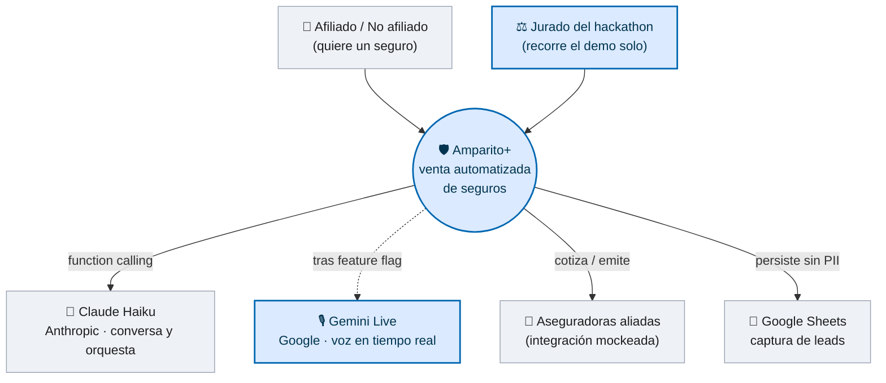
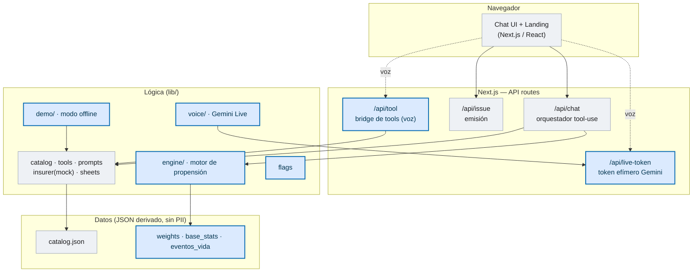
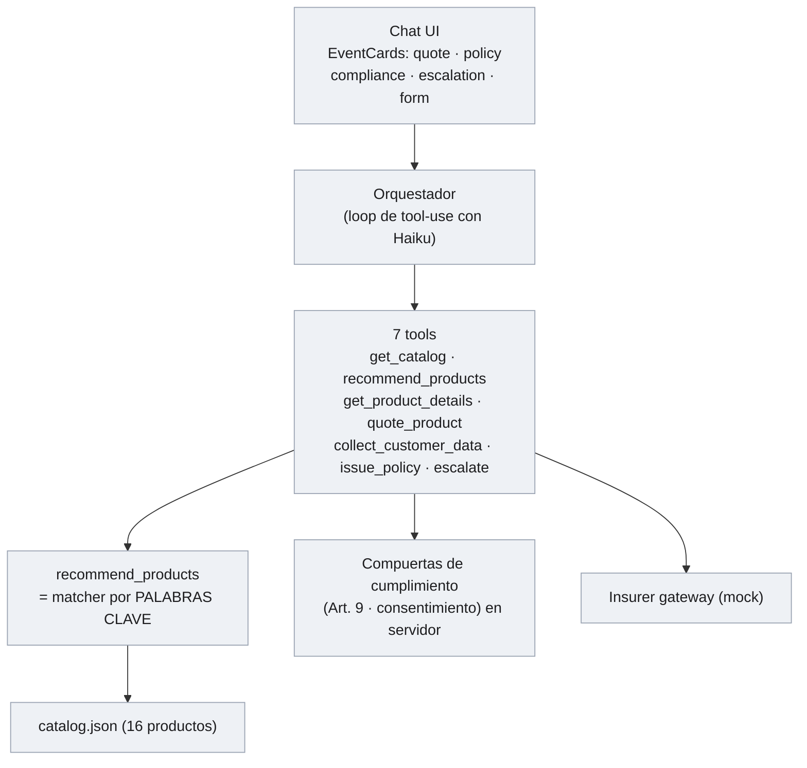
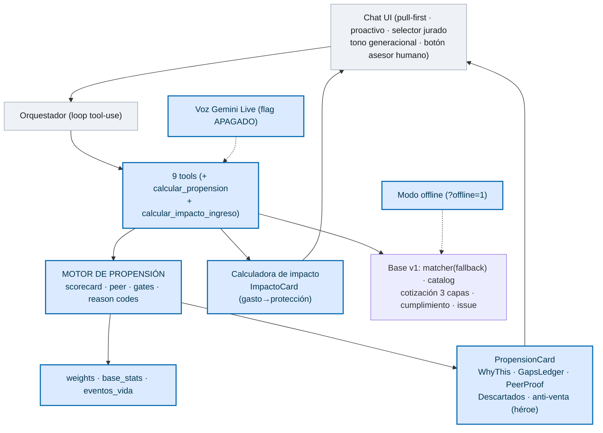

# 13 — Arquitectura C4 · Amparito base (v1) → Amparito+ (v2)

> Documenta la arquitectura en el modelo **C4** (Contexto → Contenedor → Componente) comparando la
> **primera versión** de Amparito (el MVP base, matcher por palabras clave) con la **versión resultante**
> tras los cambios de esta rama (`feature/amparito-plus`). Versión visual: `docs/reto/arquitectura-c4.html`.
> Convención: **gris = ya existía (base v1)** · **azul = nuevo o modificado en Amparito+ (v2)**.

## En una frase
**v1 (base):** un chat con Claude Haiku que recomienda por **coincidencia de palabras clave** y cierra la
venta end-to-end (cotiza, cumplimiento Art. 9, certificado mock). **v2 (Amparito+):** el mismo flujo, pero
la recomendación la produce un **motor de propensión explicable** (scorecard sobre datos reales), se hace
**visible el porqué** (capa de tarjetas), se agrega **entrada pull-first + anti-venta**, **voz Gemini Live**
(tras feature flag apagado) y un **modo demo offline**. El backend del chat no se rompió: todo es aditivo.

---

## C4 — Nivel 1 · Contexto del sistema

*Nuevo en v2:* el actor **Jurado** (modo autogestión) y el sistema externo **Gemini Live** (voz, apagada por defecto).

---

## C4 — Nivel 2 · Contenedores

*Base (v1):* `ui`, `/api/chat`, `/api/issue`, `catalog.json`, la lógica base y el gateway mock.
*Nuevo (v2):* `/api/tool`, `/api/live-token`, `lib/engine`, `lib/voice`, `lib/demo`, `lib/flags` y el uso real de `weights/base_stats/eventos_vida`.

---

## C4 — Nivel 3 · Componentes (el antes / después)

### v1 · Amparito base

### v2 · Amparito+ (todo lo de v1, **+** lo azul)

---

## Tabla resumen — qué cambió
| Capa | v1 (base) | v2 (Amparito+) |
|---|---|---|
| **Recomendación** | Matcher por palabras clave (`recommend_products`) | **Motor de propensión** explicable (scorecard + reason codes + gates) — `recommend_products` queda de fallback |
| **Datos** | `catalog.json` | + `weights.json` · `base_stats.json` · `eventos_vida.json` (usados por el motor) |
| **UI del porqué** | Tarjetas de cotización/póliza/cumplimiento | + **PropensionCard** (WhyThis · GapsLedger · PeerProof · Descartados · anti-venta héroe) |
| **Emoción (gasto→protección)** | — | + **calculadora de impacto de ingreso** + **ImpactoCard** + reframe (prompt) |
| **Generación** | Un solo tono | + **tono adaptativo** por señales (<30 / 30-45 / +50) sin preguntar la edad |
| **Letra menuda** | Todo abierto de golpe | + **disclosure en 3 capas** (síntesis visible = Art.9; términos completos a un clic) |
| **Confianza (+50)** | — | + botón **"que me llame un asesor"** (reusa `escalate_to_human`) |
| **Entrada** | Caja de chat + starters | + **pull-first** ("¿Qué quieres proteger?") + **momento proactivo** + **selector de persona (jurado)** |
| **Voz** | — | **Gemini Live** tras feature flag apagado (`/api/live-token`, `/api/tool`, `lib/voice`) |
| **Robustez demo** | Depende de la red | + **modo offline** (`?offline=1`) end-to-end + auto-fallback |
| **Tools** | 7 | 9 (+ `calcular_propension`, `calcular_impacto_ingreso`) |
| **Backend del chat** | `/api/chat`, `/api/issue` | **intactos** (todo lo nuevo es aditivo) |

## Archivos por versión
- **Solo v1 (base, sin cambios):** `lib/insurer/*`, `lib/sheets.ts`, `lib/catalog.ts`, `components/FlowVideo.tsx`, `SiteHeader.tsx`, `app/api/issue`, `app/layout.tsx`.
- **Modificados en v2:** `lib/tools.ts` (+ tool, `import type`), `lib/prompts.ts` (Estado 3), `components/Chat.tsx` (capa visual + entradas + voz + offline), `app/globals.css`, `app/chat/page.tsx`.
- **Nuevos en v2:** `lib/engine/*` · `lib/voice/*` · `lib/demo/*` · `lib/flags.ts` · `app/api/tool` · `app/api/live-token` · `scripts/*`.
